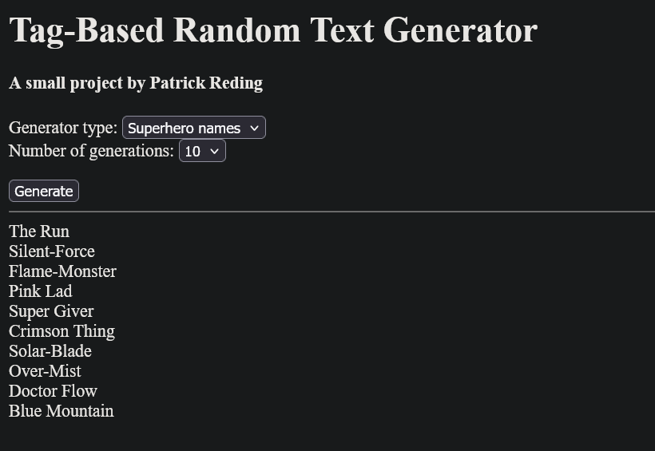

# Tag-Based Random Text Generator
#### A small project by Patrick Reding for Boot.dev's first personal project

This project demonstrates a generator program using tag parsing to generate random text according to a specification. It runs in a browser window using Pyscript to execute a client-side Python script. The program currently includes three generator definitions, defined using JSON files:

- hello_world.json: A simple "Hello, world" test.
- gen_superhero.json: A generator for superhero names, based on the character's powers and fighting styles.
- get_npc_description.json: A generator for RPG character descriptions.

The system is designed to be extended with new generator definitions by creating a new JSON file, allowing a designer to customize the generator for various use cases, including RPG utilities, writing and worldbuilding inspiration, and drawing and AI generation prompts.

### How to use



The generator is available on Github.io at [https://sikyanakotik.github.io/random-generator/](https://sikyanakotik.github.io/random-generator/). You can also download and host the files on a local Python server using:
```
python -m http.server 8100
```

You may need to wait a few seconds for the script to load before generating text.

You will see two dropdown selectors. The first selects which generator to use from the provided JSON files. The second select how many generations to produce in a batch, from one to ten. After these are set, press the Generate button to generate a list of results. These will appear below the horizontal bar. (It's not pretty, but it works.) Pressing the button again will produce a new set of results, clearing the previous results.

## Adding new generator files

The JSON files defining each generator are included in the docs/data/ folder. New generators should also be placed here. You will also need to add the file to generator_select dropdown selector and the application/json script definition in "docs/index.html". We recommend starting by copying an existing generator, such as variable_test.json, then modifying the tags and variables.

### Writing your own generators

## Generator file format

Generators are defined as JSON files in the docs/data/ folder. Each file has this shape:

```
{
  "generator": {
    "tags": {
      "...": {
        "...": "..."
      }
    },
    "variables": {
      "...": "..."
    }
  }
}
```

- tags – a mapping of tag names to their possible outputs.
- variables – optional initial values for variables used by the tag system.

The engine always starts from the tag START. This is case-sensitive.

## Tags definitions

Each tag (like "START", "PERSON", "LOWER_VERB") is defined as a dictionary mapping keys to possible expansions. These keys value may be arbitrary, but can also act as a map from a switch node (see below). Expansion text is some compination of plain text and tags.

Tags are case-sensitive, althought we encourage generator designers to use all-uppercase tag names to help distinguish them from plain text. They should not contain "<", ">", "=", or "|", as these serve as control characters. They may contain spaces, although underscores are preferred.

Example generator (included as variable_test.json):
```
"generator": {
    "tags": {
        "START": {
        "1": "[[VERB = Run]]<<CONTINUE>>",
        "2": "[[VERB = 'Dance']]<<CONTINUE>>",
        "3": "[[VERB = \"Sing\"]]<<CONTINUE>>",
        "4": "[[VERB = 'Go west']]<<CONTINUE>>",
        "5": "[[VERB = 'Pet the dog']]<<CONTINUE>>",
        "6": "<<CONTINUE>>"
        },
        "CONTINUE": {
        "1": "[[VERB]], <<PERSON>>, <<LOWER_VERB | VERB>>!"
        },
        "PERSON": {
        "1": "you",
        "2": "girl",
        "3": "boy",
        "4": "young man",
        "5": "everyone"
        },
        "LOWER_VERB": {
        "Run": "run",
        "Dance": "dance",
        "Sing": "sing",
        "Go west": "go west",
        "Pet the dog": "pet the dog",
        "default": "default"
        }
    },
    "variables": {
        VERB = "Default"
    }
}
```

### Tag syntax

The system works by repeatedly parsing and replacing the leftmost node, meaning nodes are executed depth-first, left-to-right. That is, nodes earlier in the string are executed first, and if a node expands into other nodes, those new nodes are handled before any nodes after the original node. When there are no more tags remaining the the string, the generator stops and returns the string. To prevent infinite loops, the generator stops with an error if a maximum number of iterations has been reached.

Tags cannot be nested.

The system supports four node types:

#### 1. Random select
```
<<TAG>>
```

Looks up TAG in generator.tags, and picks one of its values at random. The chosen value then replaces the node in the string. Each value has an equal chance of being chosen. In this case, the keys are ignored. Probabilities can be modified by duplicating entries in the tag definition, although each entry must still have a unique key.

Example:
```
<<PERSON>>
```

might expand to "you', "girl', "everyone", etc.

#### 2. Variable set

```
[[NAME = value]]
```

Sets generator.variables["NAME"] to the string "value", storing the value for later use. The variable is created if it does not already exist, and is overwritten otherwise. The tag is then removed from the string with no replacement. Values are stored as plain strings. They may contain control characters, but cannot include "<<", ">>", "[[", or "]]". (This is also true of plain text elsewhere.)

Variables are maintained within a generation, but not betweeen generations. This is useful for attributes like gender, class, or power type which need to appear identically at multiple points, or which can affect multiple subsequent parts of the final string. Value may include spaces, but cannot contain other tags. You can optionally use single or double quotes to allow a value to begin or end with whitespace. We encourage designers to set the variables they plan to use as early as possible in the generation process to ensure that variables are set before they are used.

Examples:
```
[[VERB = Run]]
[[VERB = 'Dance']]
[[VERB = "Sing"]]
```

All three set the variable VERB to the indicated string. (Note that double quotes in the JSON must be escaped as \").

#### 3. Variable get

```
[[NAME]]
```

Replaces the tag with the current value of the variable NAME. If NAME hasn't been set, and a default value has not been defined for NAME, the generator reports an error.

#### 4. Switch select

```
<<TAG | NAME>>
```

Uses the current value of NAME as a key, selecting the matching value from TAG's dictionary, replacing the tag with that value. If the key is not in a dictionary, the generator uses the value of the "default" tag, or returns an error if this tag is also not defined. ("default" is case-sensitive.)

Example:

```
<<LOWER_VERB | VERB>>
```

- If VERB is "Run", we use LOWER_VERB["Run"] → "run".
- If VERB is "Pet the dog", we use LOWER_VERB["Pet the dog"] → "pet the dog".
- If VERB is not a valid key, we use LOWER_VERB["default"] → "default".

Combined with the earlier parts, one possible full output of the generator is:

"Dance, everyone, dance!"

### Rules and limitations

- START must exist in tags.
- Tags are expanded left-to-right until no tags remain or a safety iteration limit is reached.
- Nesting tag delimiters inside a tag is not allowed and will raise an error. For example, "<<CLOTHING_[[CLASS]]>>" will not work. Use switch select tags for this functionality instead.
- Setting variable defaults in generator.variable is not required, but is generally a good idea outside of debugging.